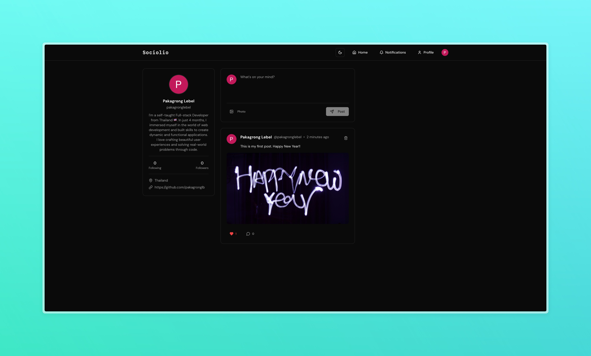

# Sociolio 📱



A full-stack social media application built with modern web technologies.


## 📝 Description

This project is a modern social media application built following the comprehensive Next.js Course 2025. It implements full-stack functionality using Next.js 14 and React, demonstrating best practices in modern web development.

## ✨ Features

- User authentication
- Real-time social interactions
- Responsive design
- Server-side rendering
- API integration
- Database management

## 🛠️ Technologies Used

- Next.js
- UploadThing
- React
- TypeScript
- Tailwind CSS
- Prisma
- Clerk

## 🎓 Credits

This project was built following the excellent tutorial by [As A Programmer](https://www.youtube.com/watch?v=vUYopHWOURg).

## 🚀 Getting Started

1. Clone the repository:
```bash
git clone https://github.com/pakagronglb/fullstack-social-media-app.git
cd fullstack-social-media-app
```

or

```bash
yarn install
```

2. Start the development server:
```bash
npm run dev
```

or

```bash
yarn dev
```

3. Open [http://localhost:3000](http://localhost:3000) with your browser to see the result.

## 📄 License

This project is licensed under the MIT License - see the [LICENSE](LICENSE) file for details.

## Environment Variables Setup
NEXT_PUBLIC_CLERK_PUBLISHABLE_KEY=''
CLERK_SECRET_KEY='
NEXT_PUBLIC_CLERK_SIGN_IN_URL="/sign-in"
NEXT_PUBLIC_CLERK_SIGN_UP_URL="/sign-up"

DATABASE_URL='

UPLOADTHING_TOKEN=''

---

⭐ If you found this project helpful, please give it a star!


